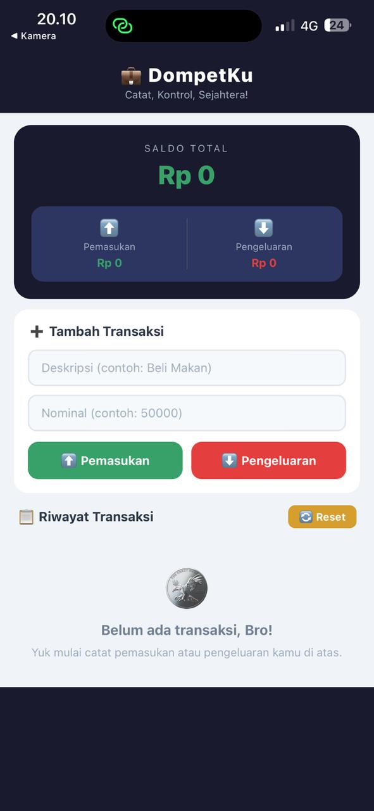
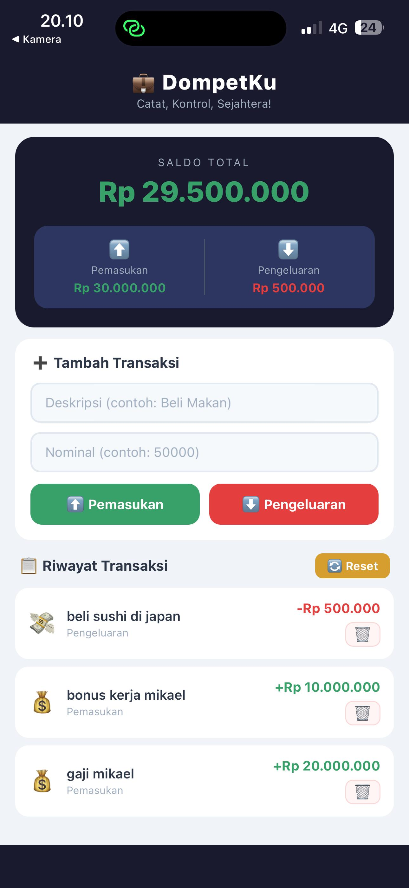

# 💼 DompetKu — Aplikasi Pencatat Keuangan Pribadi
UTS Praktikum Pemrograman Mobile | React Native (Expo)

---

## 📋 Deskripsi

DompetKu adalah aplikasi expense tracker sederhana berbasis React Native yang digunakan untuk mencatat pemasukan dan pengeluaran harian pengguna secara real-time.

Aplikasi ini membantu pengguna memantau kondisi keuangan pribadi dengan menampilkan saldo total, total pemasukan, total pengeluaran, serta riwayat transaksi dalam tampilan yang modern dan responsif.

Saldo akan otomatis diperbarui setiap kali transaksi baru ditambahkan atau dihapus.

---

## 📸 Screenshot Aplikasi

| sebelum ada transaksi | setelah tambah transaksi |
|:-:|:-:|
|  |  |

---

## ✅ Fitur yang Diimplementasikan

| Fitur | Status |
|---|---|
| Header saldo total otomatis update | ✅ |
| Ringkasan total pemasukan & pengeluaran | ✅ |
| Form input keterangan transaksi | ✅ |
| Form input nominal transaksi | ✅ |
| Tombol pemasukan (warna hijau) | ✅ |
| Tombol pengeluaran (warna merah) | ✅ |
| FlatList untuk riwayat transaksi | ✅ |
| Validasi input kosong | ✅ |
| Validasi nominal angka | ✅ |
| Format mata uang Rupiah | ✅ |
| Hapus transaksi individual | ✅ |
| Reset seluruh transaksi | ✅ |
| KeyboardAvoidingView | ✅ |
| Conditional styling nominal transaksi | ✅ |
| Empty state ketika data kosong | ✅ |

---

## 🚀 Cara Menjalankan Project

### 📌 Prasyarat

Pastikan sudah menginstall:

- Node.js versi 18+
- Expo CLI
- Expo Go di Android/iOS

Install Expo CLI:

```bash
npm install -g expo-cli
```

---

### ▶️ Langkah Menjalankan

```bash
# 1. Masuk ke folder project
cd dompetku

# 2. Install dependencies
npm install

# 3. Jalankan Expo
npx expo start
```

Setelah itu:

- Scan QR Code menggunakan aplikasi Expo Go
- Atau tekan:
  - `a` → Android Emulator
  - `w` → Web Browser

---

## 🛠 Tech Stack

| Teknologi | Keterangan |
|---|---|
| React Native | Framework mobile app |
| Expo | Managed workflow |
| React Hooks | State management |
| FlatList | Rendering list transaksi |
| TextInput | Input data |
| TouchableOpacity | Tombol interaktif |
| KeyboardAvoidingView | Handling keyboard |
| useState | Manajemen state transaksi |

---

## 🧠 Konsep yang Digunakan

- State Management menggunakan `useState`
- Array manipulation (`map`, `filter`, `reduce`)
- Conditional Rendering
- Conditional Styling
- Form Validation
- Real-time UI Update
- Responsive Flexbox Layout
- List rendering menggunakan `FlatList`

---

## 📂 Struktur Data Transaksi

```js
{
  id: Date.now().toString(),
  ket: "Beli Kopi",
  nominal: 20000,
  tipe: "keluar"
}
```

---

## 👨‍💻 Dibuat Oleh

**Mikael Putra Manullang**  
Mahasiswa Sistem Informasi  
Universitas Prima Indonesia

---

## 📌 Catatan

Project ini dibuat untuk memenuhi tugas UTS Praktikum Pemrograman Mobile menggunakan React Native dan Expo.
